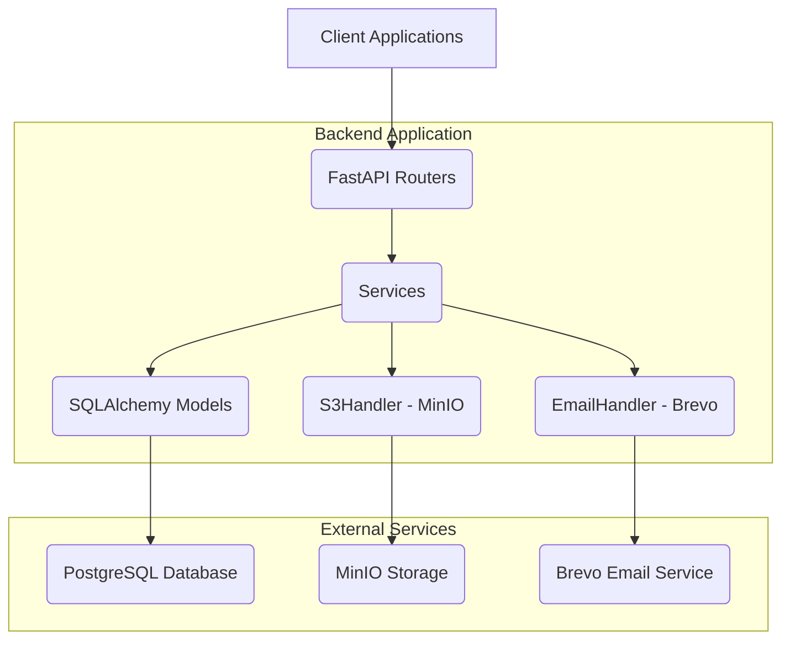
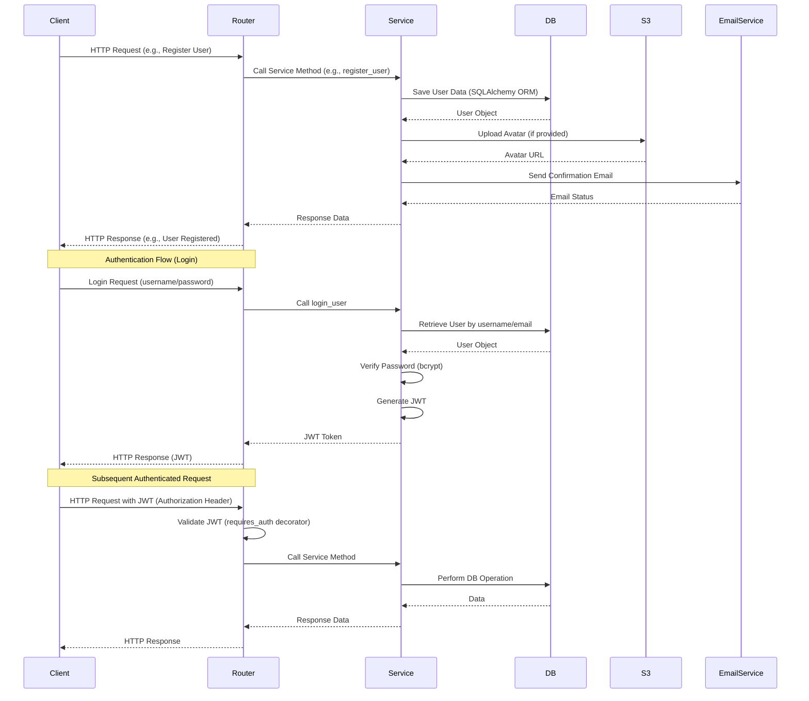

# WhatUp Application: Comprehensive Repository Overview

This document provides a comprehensive analysis of the WhatUp application's backend repository from the perspectives of a Software Architect, Software Developer, and Product Manager. It aims to offer a holistic understanding of the project's design, implementation, and strategic direction.

## 1. Overview

The WhatUp application is a social media platform with its backend services built using Python and FastAPI. It leverages a modern, asynchronous architecture to handle user management, authentication, and integration with external services like object storage and email.

**Key Technologies:**

*   **Backend Framework:** FastAPI (Python)
*   **Database:** PostgreSQL (via SQLAlchemy and `asyncpg`)
*   **Object Storage:** MinIO (S3-compatible)
*   **Email Service:** Brevo (formerly Sendinblue)
*   **Authentication:** JSON Web Tokens (JWT)
*   **Dependency Management:** `pip` with `requirements.txt`
*   **Containerization:** Docker, Docker Compose

## 2. Software Architect's Perspective

### 2.1. Architecture Design

The WhatUp backend adheres to a clear layered architecture, promoting modularity, maintainability, and scalability.



**Explanation of Layers:**

*   **FastAPI Routers (`routers/`):** The entry point for all API requests. They define endpoints, handle request parsing, and delegate business logic to the `services` layer.
*   **Services (`services/`):** Contains the core business logic of the application. Services interact with the database (via SQLAlchemy models), S3 storage, and email services. They encapsulate complex operations and ensure data consistency.
*   **SQLAlchemy Models (`models/`):** Defines the database schema using SQLAlchemy's ORM. Each model represents a table in the PostgreSQL database and handles data persistence.
*   **DTOs (`dto/`):** Data Transfer Objects, defined using Pydantic. These models are used for request validation, response serialization, and ensuring clear data contracts between the API and clients.
*   **Core (`core/`):** Houses fundamental application components such as configuration settings (`config.py`) and database connection setup (`database.py`).
*   **Utilities (`utils/`):** A collection of helper modules for common functionalities like JWT handling, S3 interactions, image processing, and email sending.
*   **Seeders (`seeders/`):** Scripts for populating the database with initial data, such as an admin user.

### 2.2. Data Flow and Interactions



### 2.3. Key Architectural Decisions

*   **Asynchronous Programming:** The choice of FastAPI and `asyncpg` for PostgreSQL, along with `aioboto3` for S3, indicates a strong commitment to asynchronous programming. This design is crucial for building highly concurrent and responsive APIs, especially for I/O-bound operations like database queries and external service calls.
*   **Containerization with Docker:** The use of Docker and Docker Compose simplifies development environment setup, ensures consistency across environments, and facilitates deployment to container orchestration platforms.
*   **External Service Integration:** Dedicated utility modules (`s3.py`, `email.py`) and configuration (`config.py`) for external services promote loose coupling and make it easier to swap out providers if needed.
*   **Pydantic for Data Validation:** Pydantic models enforce strict data validation for incoming requests and outgoing responses, reducing the likelihood of data-related bugs and improving API reliability.
*   **JWT for Authentication:** JWTs provide a stateless authentication mechanism, which is well-suited for scalable microservices architectures. The implementation includes separate tokens for account confirmation and password reset, enhancing security.

### 2.4. Scalability and Performance Considerations

*   **Asynchronous I/O:** Minimizes blocking operations, allowing the server to handle more concurrent requests.
*   **Stateless API:** JWT-based authentication means no session state needs to be maintained on the server, simplifying horizontal scaling.
*   **Database Connection Pooling:** SQLAlchemy's `create_async_engine` implicitly handles connection pooling, optimizing database resource usage.
*   **Image Processing and Security:** Handles image compression, format validation, and size limits to ensure secure and efficient storage of profile pictures.

## 3. Software Developer's Perspective

### 3.1. Development Environment Setup

The `docker-compose.dev.yaml` file provides a straightforward way to set up the development environment, including the FastAPI backend and a MinIO instance.

**Steps to get started (implied from `prompt.md` and `docker-compose.dev.yaml`):**

1.  Install Docker and Docker Compose.
2.  Clone the repository.
3.  Create a `.env` file in the `backend/` directory based on the variables defined in `backend/core/config.py`.
4.  Navigate to the project root: `cd /home/kag3ryu/whatup`
5.  Run `docker-compose -f docker-compose.dev.yaml up --build`.
6.  The API will typically be available at `http://0.0.0.0:8000`.
7.  The API documentation (Swagger UI) will be at `http://0.0.0.0:8000/docs`.

### 3.2. Code Structure and Conventions

The project follows a clear and consistent directory structure:

```
backend/
├── core/             # Core configurations (settings, database)
├── dto/              # Data Transfer Objects (Pydantic models)
├── models/           # SQLAlchemy ORM models
├── routers/          # FastAPI API endpoints
├── services/         # Business logic
├── utils/            # Utility functions (JWT, S3, email, image)
├── seeders/          # Database seeding scripts
├── templates/        # Email templates
├── tests/            # Unit/Integration tests (currently empty)
├── main.py           # FastAPI application entry point
├── requirements.txt  # Python dependencies
└── ...
```

*   **Naming Conventions:** Python's PEP 8 guidelines appear to be followed (snake_case for variables and functions, PascalCase for classes).
*   **Type Hinting:** Extensive use of type hints improves code readability, enables static analysis, and aids in development with IDEs.
*   **Docstrings:** While not universally present, some functions and classes have docstrings, which is a good practice for explaining complex logic.

### 3.3. Key Libraries and Their Usage

The `backend/requirements.txt` file lists the following key libraries:

*   **`fastapi`**: The web framework for building APIs.
*   **`sqlalchemy`**: ORM for interacting with PostgreSQL.
*   **`asyncpg`**: Asynchronous PostgreSQL driver.
*   **`pydantic`**, `pydantic-settings`: For data validation, serialization, and managing settings from environment variables.
*   **`passlib`**: For securely hashing and verifying user passwords (specifically `bcrypt`).
*   **`python-jose`**: Handles JWT creation and verification.
*   **`aioboto3`**: Asynchronous client for Amazon S3 (and compatible services like MinIO).
*   **`sib-api-v3-sdk`**: Brevo (Sendinblue) API client for sending transactional emails.
*   **`Jinja2`**: Templating engine for rendering HTML email templates.
*   **`python-multipart`**: For handling `multipart/form-data` requests (e.g., file uploads).
*   **`pillow`**: For image processing (e.g., resizing, format conversion).
*   **`ruff`**: A fast Python linter, indicating a focus on code quality.

### 3.4. Authentication and Authorization Implementation

*   **Decorators:** Custom decorators (`@requires_auth`, `@requires_admin`, `@requires_no_auth`) are used to protect API endpoints, making it easy to apply authentication and role-based authorization.
*   **JWT Flow:**
    1.  User logs in, `UserService` generates a JWT.
    2.  The JWT is returned to the client.
    3.  For subsequent requests, the client sends the JWT in the `Authorization` header.
    4.  The `requires_auth` decorator decodes and verifies the JWT, extracting user information (ID, role) and storing it in `request.state.user`.

### 3.5. Database Migrations

The presence of `alembic` in `requirements.txt` suggests that Alembic is intended for database migrations. However, the current setup in `main.py` uses `Base.metadata.create_all` in debug mode, which is suitable for initial development but not for production database schema management. A full Alembic setup with versioned migrations would be necessary for production deployments.

### 3.6. Testing

The `tests/` directory exists but appears to be empty (`__init__.py` only). This indicates that unit and integration tests are either not yet implemented or are managed elsewhere. For a robust application, comprehensive testing is crucial.

## 4. Product Manager's Perspective

### 4.1. Core Features and User Journeys

The backend supports the following key user-facing functionalities, as detailed in `prds/current/01_core_features.md` and `prompt.md`:

*   **User Registration:**
    *   Users can sign up with a username, email, and password.
    *   Optional avatar upload during registration.
    *   Account confirmation via email is required.
*   **User Authentication:**
    *   Users can log in using their username/email and password.
    *   Receives a JWT upon successful login for subsequent authenticated requests.
*   **Profile Management:**
    *   Users can upload multiple profile pictures (up to 5).
    *   Users can set one profile picture as active.
    *   Users can delete existing profile pictures.
    *   Users can retrieve their own profile information, including a list of all their profile pictures.
    *   Image uploads are subject to security checks (format, size, corruption).
*   **Password Management:**
    *   Users can request a password reset via email.
    *   Users can reset their password using a token from the email.
*   **Public Key Management:**
    *   Users can update and retrieve their public key. This suggests future features related to secure messaging or end-to-end encryption.
*   **Account Deletion:**
    *   Users can delete their own account.

### 4.2. Admin Capabilities

The application includes specific functionalities for administrators, as detailed in `prds/current/02_admin_capabilities.md` and `prompt.md`:

*   **Admin User Seeding:** An initial admin user is created automatically on application startup if not present.
*   **User Management:** Admins can view all users, edit user roles, confirm user accounts, and delete any user account.

### 4.3. External Integrations

As outlined in `prds/current/03_external_integrations.md` and `prompt.md`:

*   **MinIO (S3-compatible storage):** Used for storing user profile pictures. The `minio/policy.json` grants public read-only access to the `whatup` bucket, meaning anyone can view uploaded profile pictures. This is suitable for public profiles but might need review for privacy-sensitive content.
*   **Brevo (Email Service):** Essential for transactional emails like account confirmation and password reset.

### 4.4. Future Product Expansion (Implied)

The presence of `group.py`, `group_member.py`, and `message.py` models (though not yet fully exposed via services/routers) strongly suggests that the product roadmap includes, as detailed in `prds/current/04_future_expansion.md` and `prds/next/01_next_features.md`:

*   **Group Management:** Creating, joining, and managing user groups.
*   **Messaging:** Sending and receiving messages, potentially within groups.
*   **Secure Communication:** The public key management feature hints at implementing end-to-end encrypted messaging.

### 4.5. Security and Privacy Considerations

As highlighted in `prds/current/05_security_privacy.md` and `prompt.md`:

*   **Password Security:** Passwords are hashed using `bcrypt`.
*   **Account Confirmation:** Email verification adds a layer of security against bot registrations and ensures valid email addresses.
*   **Password Reset Flow:** A secure token-based mechanism for password resets.
*   **Public S3 Bucket:** The `minio/policy.json` explicitly sets public read access for the `whatup` bucket. While convenient for public profile pictures, this needs to be a conscious product decision, especially if other types of user-uploaded content are planned.

## 5. Recommendations

### For Software Architect:

*   **Database Migrations:** Fully integrate Alembic for managing database schema changes. This is critical for production environments to ensure smooth updates without data loss. The current `Base.metadata.create_all` is only suitable for development.
*   **Centralized Error Handling:** Consider a more centralized and standardized approach to error handling beyond just `HTTPException` in routers, possibly using custom exception classes and a global exception handler.
*   **Logging:** Implement a robust logging strategy for application events, errors, and performance metrics.
*   **Monitoring:** Plan for monitoring and alerting solutions to track application health and performance in production.
*   **API Versioning:** As the API evolves, consider implementing API versioning (e.g., `/v1/user`, `/v2/user`) to manage changes gracefully.

### For Software Developer:

*   **Comprehensive Testing:** Prioritize writing unit, integration, and end-to-end tests. This will significantly improve code quality, reduce bugs, and facilitate future development. The `tests/` directory is currently empty.
*   **Documentation:** Enhance docstrings for all functions, classes, and modules, especially for complex logic or public APIs.
*   **Code Linting and Formatting:** Ensure consistent code style using tools like Ruff (already in `requirements.txt`) and Black. Integrate them into CI/CD pipelines.
*   **Dependency Updates:** Regularly review and update dependencies to benefit from bug fixes, performance improvements, and security patches.
*   **Environment Variables:** Provide a `.env.example` file to clearly document required environment variables.

### For Product Manager:

*   **Define MVP for Group/Messaging Features:** Prioritize and define the Minimum Viable Product (MVP) for the group and messaging functionalities, as hinted by existing models.
*   **Privacy Policy for S3:** Clearly communicate the public nature of uploaded avatars/media to users in the privacy policy and terms of service. If private media is planned, a different S3 bucket or access control strategy will be needed.
*   **User Feedback Loop:** Establish mechanisms for collecting user feedback to guide future feature development.
*   **Analytics:** Integrate analytics to understand user behavior and feature adoption.
*   **Monetization Strategy:** Begin exploring and defining a clear monetization strategy for the platform.
*   **Security Audit:** Conduct a security audit, especially before public launch, to identify and mitigate potential vulnerabilities.
